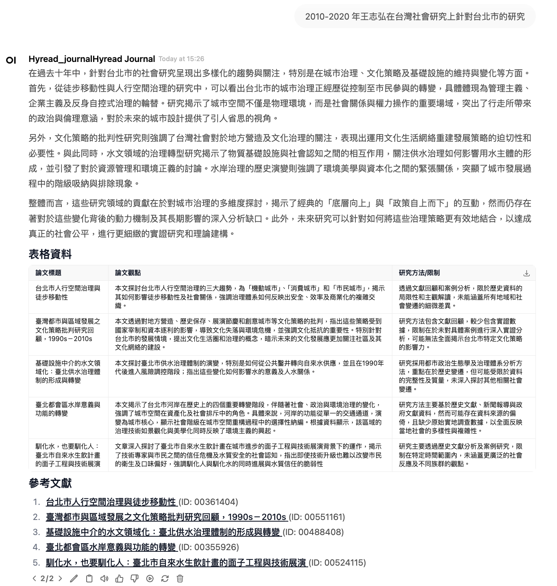

# WebUI – Hyread Journal RAG Pipe

## 一、概述

`Pipe` 類別為 WebUI 提供與 Hyread Journal RAG 系統整合的介面。用戶輸入查詢後，此類別會轉發至後端 RAG API，並以串流方式回傳 AI 生成的摘要、表格資料與參考文獻等內容。

---

## 二、結構

```
Pipe
├── __init__           # 初始化模型名稱與 API 設定
├── on_startup         # 啟動訊息
├── on_shutdown        # 關閉訊息
├── pipes()            # 提供模型清單 (id + name) 給 WebUI
└── pipe(**kwargs)     # 核心邏輯：處理用戶輸入、送出 API 並串流結果
```

---

## 三、Valves 設定參數

使用 `Pydantic` 模型 `Valves` 儲存各項配置參數：

| 參數名稱            | 說明                    | 預設值                                                                          |
| --------------- | --------------------- | ---------------------------------------------------------------------------- |
| API\_URL        | RAG Streaming API 的網址 | [http://host.docker.internal:8000/rag](http://host.docker.internal:8000/rag) |
| MODEL\_NAME     | 顯示於 WebUI 的模型名稱       | Hyread Journal                                                               |
| MODEL\_ID       | 模型唯一識別碼               | hyread-journal-rag                                                           |
| SEARCH\_TOP\_K  | 每次查詢取得的文獻數量           | 10                                                                           |
| SHOW\_AI\_PARAM | 是否回傳 GPT 解析出的搜尋參數     | False                                                                        |

---

## 四、核心邏輯：`pipe(**kwargs)`

### 1. 取得用戶查詢

從傳入的 `body` 物件中解析用戶最後一句訊息：

```python
messages = body.get("messages", [])
query = next((msg.get("content") for msg in reversed(messages) if msg.get("role") == "user"), None)
```

* 若找不到用戶訊息，回傳錯誤提示

---

### 2. 傳送 API 請求

組裝查詢內容為 payload，並使用 `requests.post` 傳送 JSON 至後端 API：

```python
payload = {
  "query": query,
  "top_k": self.valves.SEARCH_TOP_K,
  "show_ai_params": self.valves.SHOW_AI_PARAM,
}
response = requests.post(API_URL, json=payload, stream=True)
```

---

### 3. 處理串流回應

從 `response.iter_lines()` 逐行讀取 JSON 資料並處理三種類型內容：

* `summary`：回傳摘要文字
* `table_row`：儲存 markdown 表格列
* `references`：儲存參考文獻陣列

結束後，整合輸出表格與參考文獻如下：

#### 表格資料範例：

| 論文標題             | 針對問題的核心洞察                                                                 | 研究方法/限制                                                                                  |
|----------------------|------------------------------------------------------------------------------------|-----------------------------------------------------------------------------------------------|
| 氣候變遷與人類健康   | 本研究指出極端氣候事件顯著增加多種疾病風險，包括呼吸道、心血管及精神疾病，並強調建立預警系統的重要性。數據顯示，在高溫及極端天氣條件下，急診病例增加約30%。 | 採用文獻回顧與數據分析方法，限制在於未進行實地實驗，且地區差異可能影響結論普遍性。            |
| 氣候變遷與健康促進   | 指出熱浪、寒流、水災與風暴對健康的直接風險，特別是對弱勢群體。主張健康促進策略應融入氣候變遷應對，提供健康城市與社區的實例。 | 採用文獻回顧與範例分析，限制為缺乏實證數據，未能量化健康促進措施對氣候變遷的具體效果。        |


#### 參考文獻範例：


1. [台灣氣候變遷與糧食安全研究](https://www.hyread.com.tw/hyreadnew/search_detail_new.jsp?sysid=ABC123) (ID: ABC123)
2. [農業應變策略](https://www.hyread.com.tw/hyreadnew/search_detail_new.jsp?sysid=XYZ456) (ID: XYZ456)


---

### 4. 錯誤處理

支援以下例外處理：

* API 無法連線：

  ```
  無法連接 API：<錯誤訊息>
  ```

* JSON 解碼錯誤：

  ```
  JSON 解析錯誤: <錯誤內容>
  ```

* 其他例外錯誤：

  ```
  處理過程發生錯誤：<錯誤內容>
  ```

---

## 五、WebUI 整合流程

```mermaid
sequenceDiagram
    participant User
    participant WebUI
    participant Pipe
    participant RAG_API

    User->>WebUI: 輸入查詢內容
    WebUI->>Pipe: 呼叫 pipe(**kwargs)
    Pipe->>RAG_API: 發送 POST 查詢（streaming）
    RAG_API-->>Pipe: 回傳 summary / table_row / references（逐行）
    Pipe-->>WebUI: 串流逐段回傳內容
    WebUI-->>User: 即時顯示摘要與文獻
```

## 六、測試範例


